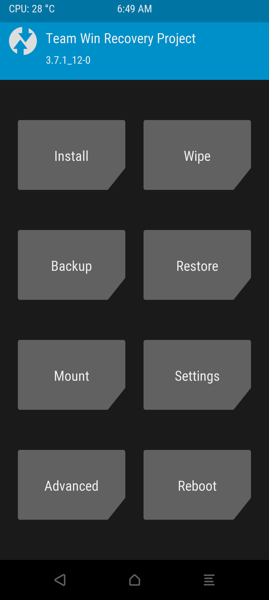
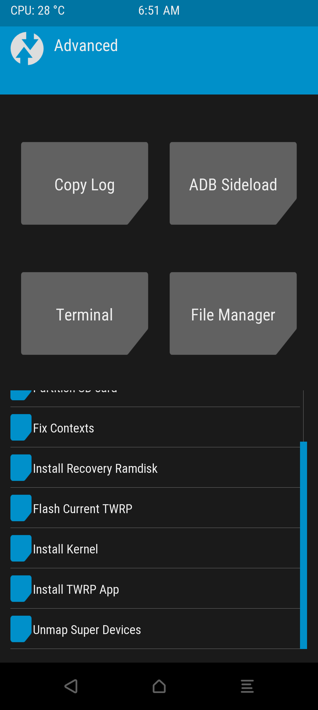

# TWRP Device Tree for Xiaomi 14T (`degas`)


Unofficial TWRP (Team Win Recovery Project) device tree for the **Xiaomi 14T**
(code‑named **`degas`**, MediaTek Dimensity 8300‑Ultra `mt6897`, HyperOS 3 /
Android 16) — **plus** the full research that went into trying to make File‑Based
Encryption (FBE) decryption work in recovery.

## 📌 Project Status: Alpha → now open‑sourced

The recovery **boots and is fully usable** (touch, display, ADB). The one big
piece still missing is **decrypting `/data`**: the device uses FBE +
metadata encryption (`dm-default-key`) and the standard TWRP crypto path cannot
bring up the keystore stack under recovery on this SoC.

> ⚠️ **I no longer own this phone and may not be able to continue.** This repo
> was previously a private placeholder; it is now cleaned up and released so
> that someone else can pick it up. Everything I learned about the decrypt
> problem is written down in **[`docs/RESEARCH.md`](docs/RESEARCH.md)**. The
> hardest, most interesting part is genuinely close — see
> [Next steps](docs/RESEARCH.md#next-steps). **PRs and forks welcome.**

## 🔩 Device

| | |
|---|---|
| Model | Xiaomi 14T |
| Codename | `degas` |
| SoC | MediaTek Dimensity 8300‑Ultra (`mt6897`) |
| Architecture | arm64 (Cortex‑A715 + Cortex‑A510) |
| OS at time of work | HyperOS 3 (Android 16) |
| Partitions | A/B, dynamic (super), `vendor_boot` GKI v4 |
| Userdata FS | F2FS, FBE `aes-256-xts` + metadata encryption (`dm-default-key`) |
| Touch | Goodix (firmware + patched `xiaomi_touch_common.ko`) |

## 🛠️ Current Progress & Hardware Support

*   [x] **Core Boot:** Successful kernel boot using GKI v4 headers and ramdisk layout.
*   [x] **Display & GUI:** TWRP interface rendering correctly.
*   [x] **Touchscreen:** Fully operational. Achieved via custom injection of Goodix firmware and a patched `xiaomi_touch_common.ko` directly into `vendor_ramdisk00` (see `patch_touch.sh`).
*   [x] **Partition Mounting:** `xiaomi_dynamic_partitions` with `erofs` + `ext4` fallback mappings.
*   [ ] **FBE Decryption (Data):** Work in progress. A set of `LD_PRELOAD` shims brings up servicemanager, KeyMint, Gatekeeper and Keystore2 by hand inside recovery; the TEE responds and the stack registers, but `twrp decrypt` still dies before `dm-default-key`. Full analysis in [`docs/RESEARCH.md`](docs/RESEARCH.md).
*   [ ] **MTP / USB OTG:** *intentionally disabled.* `patch_touch.sh` binary-patches the recovery (`sys.usb.config` → `sys.bak.config`) so TWRP can't touch the USB gadget, which keeps **ADB** stable during the keystore bring-up. MTP and USB-OTG mode switching are the trade-off — revertible by dropping that one `sed` line.
*   [ ] Haptics / Vibration
*   [ ] Other

## 📂 Repository layout

```
device/xiaomi/degas/        TWRP device tree (the part you build)
  BoardConfig.mk            board / partition / crypto / AVB config
  device.mk                 product packages (vold, keymint, gatekeeper, …)
  twrp_degas.mk             product definition (lunch target twrp_degas-eng)
  recovery.fstab            recovery fstab (logical partitions + FBE userdata)
  prebuilt/                 prebuilt boot.img, dtbo.img and dtb (build inputs)
  recovery/root/            files baked into the recovery ramdisk (touch fw)
  sepolicy/                 device sepolicy

decrypt/                    FBE-decrypt research (the experimental part)
  README.md                 ⭐ per-component reference: every shim + script
  from_scratch.sh           master script: build shims, push, bring up stack
  deploy.sh                 fast redeploy of just servicemanager + keymint
  sm_stab3.c                LD_PRELOAD shim for servicemanager
  hwsm_log.c                LD_PRELOAD shim for hwservicemanager
  km_intercept3.c           LD_PRELOAD shim for keymint + gatekeeper HALs
  ks2_log.c                 LD_PRELOAD shim for keystore2
  twrp_fix.c                LD_PRELOAD shim for recovery_real (the TWRP binary)
  throw_logger_alt.c        alternate recovery shim with a stack-backtrace abort
  bind_mount.c              tiny static helper to bind-mount the binder node
  libbinder_{sys,ndk}.so    captured device libs (reference, not rebuildable)
  adb                       adb wrapper that hides the linker warning spam

patch_touch.sh              repacks recovery with the patched Goodix touch driver
xiaomi_touch_common_patched.ko

docs/RESEARCH.md            full decrypt research log (architecture, findings,
                            error chronology, hypotheses, next steps)
```

> This tree is meant to be checked out inside a minimal TWRP build manifest. The
> `.gitignore` is a whitelist: it ignores the surrounding AOSP/TWRP tree and
> tracks only the files listed above. Compiled `.so` artifacts and built
> recovery images are intentionally not committed (rebuild from source / use
> Releases).

## ⚙️ Building

Use a minimal TWRP build environment, place this tree at `device/xiaomi/degas`,
then:

```bash
. build/envsetup.sh
lunch twrp_degas-eng
mka vendorbootimage        # flash the resulting vendor_boot.img
```

The prebuilt kernel/DTB live in `device/xiaomi/degas/prebuilt/`. To get a
working touch panel in recovery, run `patch_touch.sh` after the build to splice
the patched driver + Goodix firmware into the recovery ramdisk and repack.
(Adjust the `WORKDIR` block at the top of that script — its paths are
environment‑specific.)

## 🔐 The decryption work (for whoever continues)

This is the reason most of this repo exists. Rather than patching TWRP's C++
crypto code, the experiment runs the **real** stock Android binaries inside
recovery (servicemanager + keystore2 from the `system_a` image, keymint +
gatekeeper from the `vendor` partition) and bends them into shape with small,
per‑process `LD_PRELOAD` shims that stub out the checks that fail under recovery
and trace everything. The flow we're trying to complete:

```
recovery_real
  → AServiceManager_waitForService("…keystore2.IKeystoreService/default")
    → keystore2  (started by hand)
      → keymint binder → TEE (MITEE: TEEC_OpenSession → 0x0, works)
  → gatekeeper.verify(pin) → auth token
  → CE key → dm-default-key → mount /data
```

Run it with the device in this TWRP build, connected over ADB, and an AArch64
cross compiler (`aarch64-linux-gnu-gcc`) installed:

```bash
cd decrypt
./from_scratch.sh          # builds shims, pushes, mounts, starts the stack
adb shell 'twrp decrypt <pin>'
```

📖 **[`decrypt/README.md`](decrypt/README.md)** is a per-component reference —
every shim and script explained ("what each file does and why"). Start there to
understand the code. The current blocker, what already works, and concrete next
debugging steps are in **[`docs/RESEARCH.md`](docs/RESEARCH.md)**.

## 📸 Proof of Boot

<details>
<summary><b>Click to view screenshots</b></summary>




</details>

## 🤝 Contributing / Help Wanted

**Forks, experiments and PRs are very welcome — this project is looking for
people to carry it forward.** There's a real prize on the table: nobody has a
fully working FBE `/data` decrypt in recovery for this SoC family yet, and the
hard 90% is already done and documented. It dies just a couple of steps before
`dm-default-key`.

- 🟢 **Easy:** build it, test it on your `degas`, fix docs where reality differs.
- 🟡 **Medium (have the device):** run `decrypt/from_scratch.sh` and capture the
  `RA=` from the second `std::terminate` — the single most useful data point
  right now.
- 🔴 **Hard:** crack hypothesis A/B/C in [`docs/RESEARCH.md`](docs/RESEARCH.md#next-steps)
  and get `/data` to mount. 🎉

Even "I tried X, here's the log, it didn't work" is a valuable PR or issue —
it rules out a path. See **[CONTRIBUTING.md](CONTRIBUTING.md)** for how to start,
ways to help by difficulty, code style, and how to send a good PR.

## ⚖️ License

This project is licensed under the Apache License 2.0 — see the [LICENSE](LICENSE)
file for details. Recovery/device‑tree pieces inherited from TWRP follow their
upstream licenses (GPL); the AOSP makefiles are Apache‑2.0.

---
*Maintained by Advnirr | [advnirr.org](https://advnirr.org)*
